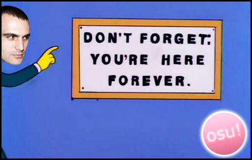
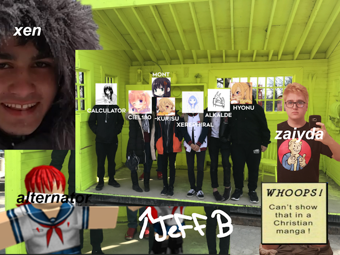
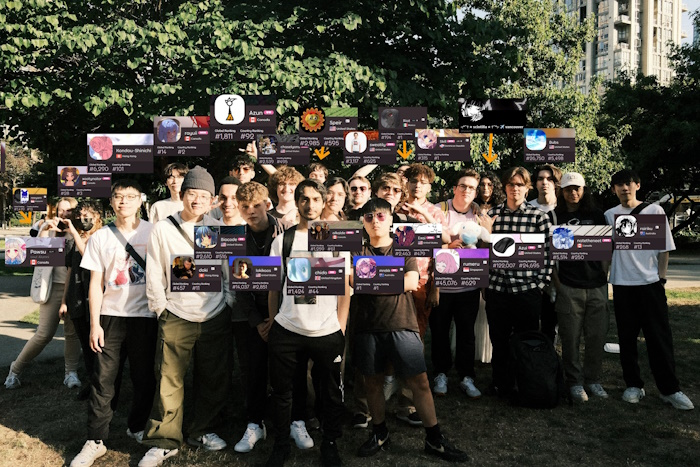
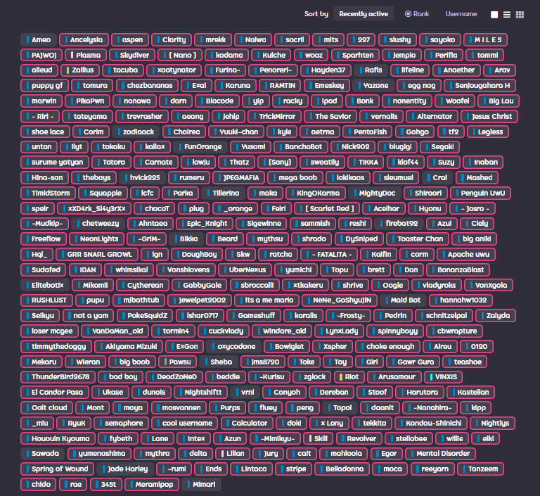

so there it is — 10 whole years of being associated with osu!. when asked about my feelings of the game, i find it to be very hard to compactly describe. they're complex, as i'm sure any person who has expended so much of not just their time, but also their personhood at large would feel.

i really don't remember exactly how i got into the game as a kid. it probably was some extension of the league of legends community, as i found role models in competitors like hai, pobelter, and dyrus. dyrus had a previously viral clip of him getting a pentakill, and then immediately playing an osu map after. it could have also been an accidental stumble upon the game when reviewing roms for my EDGE cartridge.[^6] regardless of how it happened, i ended up registering for my first account in october of 2015.

i don't think i ever viewed myself as going ultra try-hard and getting to the level i'm at in osu!. this isn't to say i didn't have a competitive nature about video games back then — i had pipe dreams of being global elite in csgo, playing in esea on tf2, and getting really good at league (whatever that meant to me). osu! seemed similar to the reputation given to it by the league players i mentioned previously: a game meant to help you warm up micro-actions for other games. yet still in spite of this, i remember seeing these starter maps with a competitive drive i rarely felt about many other games. at the time, it all still felt like a game (and to this part, i do still see it as such generally). but something changed for me in this first year.

osu! world cup. 2015. for those that were around during the time, you would understand how legendary of a match this was. as a canadian into esports, i was used to the standard fact that north americans are just too easily outclassed by european and asian talent in most competitive games. this was true for league of legends, for csgo, for team fortress 2 — i could go on, but most importantly, it was still true for osu!. up to this point, americans had never placed higher than 5th-6th, with this placement being in the last year's world cup, regularly placing within the 9th-12th result line. while not involved with the scene beforehand, i had heard about the storyline from many casters alike. i had the gift of being able to witness this tense grand finals match live, alongside every other random viewer worldwide. seeing the american roster overcome that stereotype against a scary chinese roster (which simultaneously had poor results over the past 5 years of the world cup) in a tiebreaker on furioso melodia is something that forever changed my view on the game.

pair this with the return of shigetora, the most prominent osu! player of all time (logistically), and i was fired up. seeing such cool events, scores and general energy just happening around me kept me coming back, even in spite of friends being annoyed and disturbed by me being unmuted and chilling in skype chat while playing.[^1] i think reality kinda set in for me when i hit the top 20k that this was something i really wanted to keep playing.[^2] even as i got better and better, overcoming the limits of singletapping by learning how to alt, and even [pushing past into 3 digit](https://www.youtube.com/watch?v=HTLkovQQOgo),[^3] accomlishing things like my first 400pp play, getting my biggest tourney win in [ryuk & pikapwn](https://www.youtube.com/watch?v=DrooQqy5vmE&t=3214s), and so many more random scores that i could name off. i think around then, i began to stagnate. 

osu!, for those who haven't played consistently enough to see a downturn of scores while still actively playing, sucks. being in a rut is *usually* a completely mental block related effect. you continue to play the game, not to set a play, but because of the chances that you improve past a certain level to where maybe, just maybe, the stuff you *want* to hit will at that point, seem easy to you. therein grows a harmful cycle of never being able to reach that max potential, but that might just be me. either way, i remember where i was when i undid my biggest rut. on a random friday, i was 15 years old. it was a completely random map, i put on dt for fun, and suddenly noticed i was hitting everything. suddenly, i had made leaderboards on: [stronger than you -chara response-](https://www.youtube.com/watch?v=lPQlD8AuHyc). does this map matter at all in the grand scheme of things? no, it was a 380pp play. did it even matter then? not really... it was a 5.15* map pre-dt. what matters is that i finally felt like i was hitting things that i regularly wouldn't be able to hit. it stands out so much in my memory as an essential figurestone in me being decent vs me being bad. from there, i just kept going.

while i just mentioned osu!'s ruts, it also has the exact opposite effect that i used to coin "the golden week." back in the day, osu! players would have on and off periods where you wouldn't see them mentioned for months, and suddenly for some short timespan, have them dominate /r/osugame with insurmountable scoreposts. this wasn't because new maps were being ranked (at least most of the time), it was because they had hit a groove, hit a movement. realistically, this is likely some kind of psychological effect similar to, if not literally, hot hand syndrome. whatever you want to call it, we all have our own. and from that *stronger than you* score, i began mine. one of my biggest accomplishments was getting [my first 500pp score](https://www.youtube.com/watch?v=yc7c9IW6pnk), especially considering the names on the leaderboard at the time (rizki, ryuk, fieryrage, mathi, alumetri), and it being a 300bpm map, which were just played less at the time. getting to my peak over the course of the next year really doesn't feel memorable to me, probably just because of the events following said grind being some of the best of my life, but the game began to fade out for me from there. sure, i was still friends with many community members, but it felt like my interest in competing was lulled. i had started to date, started to engage more with my peers, started to find more interest in the games i had cast aside, like league.[^4] but as was written:

once again, osu! is so amazing because of how casually you can pick up the game again. sure, you'll be a little bit rusty, but i've never had an intensive amount of rust to overcome to be *enjoying* the game again. and isn't that what matters? isn't the game *meant* to be fun? something i've overanalyzed in myself is that no matter what, if i am not rusty, and i am having fun with the game, my likelihood to do better shoots up exponentially. complicating the game with the attitude of success or failure was my biggest detriment to my overall approach. i never even *noticed* that i would get nervous (if i even did) before someone mentioned clammy hands while starting scores. but i digress.

getting back into the game was always done in short stints. i don't think i'll ever truly come back to the game to the level i did back when i was 17, try as i might. mentally, i'm not able to keep those thoughts of success and victory out of my head. the game just isn't as interesting and motivating as it was when i was 17. and that's okay! people move on. and even still, i'm sure some of my major feats are stuff i'll look back on fondly. i wanted to give attention to two plays quickly, two plays that i'll probably never change my mind on as my best ever.

---

1. tsukinami +hddt FC 635pp
   [video link](https://www.youtube.com/watch?v=OzXXgUKRBRo)

this is a result of my recent push in the game, and probably the one that'll matter the most to me unless i can get a 700 that i care about. tsukinami is probably *the* song in osu! for me. the original kagetsu mapset alone is one that always left me aghast when watching plays set on it, but i think this was increased tenfold when watching the vaxei 1000pp. that moment *defined* osu! for the next few years. it inspired me to finally [finish a map](https://osu.ppy.sh/beatmapsets/1007744#osu/2109131) for the first time in ever. to finally be able to claim a score on here, especially with such a classic story of being hard stuck at a low combo breakpoint in the map, is something i'll always be happy i've been able to accomplish.

2. yume tourou +hddthr 1 miss 597pp #5
   [video link](https://www.youtube.com/watch?v=NnLepBLLFO8)

this play is always gonna be my what if. three mod doesn't feel hard to me (aside from accuracy) imo, although that's just resilient training from being on a 60hz monitor up until this point. this score, when comparing with who was on the leaderboard at the time, made me think — no matter how naively — that i was doing something really hard and really rare. i've always been a monstrata truther (even though he gets annoying online), and this mapset has [been with me](https://www.youtube.com/watch?v=kLjX2IYVp0k) [for ages](https://www.youtube.com/watch?v=nyqjTUQmm9k). it's nice to have it with me still.

---

anyway, i've been ranting a lot about my personal experience with the game directly, but i think the most important aspect, and the real reason why i stick around so much, is the community. all the other games: league of legends, csgo, rainbow six siege. they boast a much more competitive nature and noticeable give-back if you get good at the game. osu! ... really doesn't. aside from a handful of top players, the game doesn't make you money. all the other games i just listed will likely land you a team, a salary, a sponsorship if you are good enough to compete. in comparison, osu! landed me, a "tournament winner,"[^5] landed me 30~ bucks after several tournaments. but, as a result of it's small size, osu! felt more so like a *community* than any other game.

i probably would've quit osu! early on in 2017. i really didn't lie about my competitive drive, and me being hardstuck in league was starting to annoy me when playing with other friends. at the time, i knew basically nobody besides canadian players, if even that, and my attachment to the game was only about to ramp up. then, a certain player named Xenouz found me. Xenouz, or as many of you may know him, takyonxen / xen / hayden, is a canadian osu! player and hard lover of the game. he's had a certain eye for people up and coming for as long as i've known him, recognizing how vaxei, mrekk, wombraider, and so many more players would be reaching heights never before seen. he also wanted to foster a local community. hayden was a player local to me, and upon finding me, alongside my activity, created and invited me to a server lovingly called *Gay Kidz*. this chat, made up of hayden, myself, -kurisu, mont, hyonu, and zaiyda, began the starting roots of a community in our little province, fostering the first meetups within the province, entering tournaments as a unit, having some goofs and gaffs, recruiting others both locally and internationally, and most importantly, forming some roots to lifelong friendships; some directly related, and some completely unrelated to the game. while the scene has changed, and i'm no longer involved with the provincial level groups, i look back on these eras with such a strong fondness.

more important to my modern day-to-day, around this time, i met people like *rHO*, *sammish*, *Exai*, *semaphore*, and so many more people based on a growing appreciation for music and desire to be more involved in the scene — something that can also be somewhat tied to the growing appreciation for american music in osu!. i remember feeling so fish out of water with these peoples named. i felt like the new kid on the block, having to weasel my way into knowing these people. little did i understand, that everybody here felt the same. while it didn't really hit with me until i reached a mature age, i feel so so lucky to have a lot of these people close. these are connections i still hold today, and connections that grew into connecting with people i talk to daily. *stay down*, in of itself, is based in osu! connections. this group was something so important to me that i found it important to myself to travel to vancouver for the first time just to be able to see them in person. it's one of my closest, most heartfelt memories in life. i don't regret it for even a moment.

a lot of people spend their days reflecting on wasted time. for most, osu! looks exactly like such. it's a game built around repetitively retrying to set scores by clicking and aiming on pre-defined note placements. personally, when reflecting like this, i think about what other skills i could've developed in this time. i could've been a better developer, a better musician, a better editor, better read, even better at a more relevant game. every single time when asked if i would've traded it away, its hard to say anything but no. while not solely responsible, osu! — especially the connections it's made me — has made me who i am today. i don't think i could ever think to reverse any of the time spent, because while it's taken me a while to actually admit it, i am **proud** of what i've accomplished in osu!. while i wouldn't exactly want my offspring to be completely enveloped in it's grasp, i thank osu! for a lot in who i am and how i see the world today. it's getting very messily sappy, so i'll end with a thank you to the game, a thank you to osu!, and a thank you to you for feigning interest long enough. 

and to think, all of this was over a circle clicking game?

*2018*

*2023*

(◍´◡\`◍)

[^1]: back when sound filtering didn't really exist ... interesting times. my khazix main league friend hated my ass until we bonded over other random things.

[^2]: note: back then, 10k was pretty quickly achieved. i got 4 digit about 2 months after i got my [first 200pp play](https://www.youtube.com/watch?v=w_HqGQgJBL4)! really fun to see the amount of high level players that have come and filled out these ranks.

[^3]: which i only remembered while writing this up, actually was a *little* controversial. i had just been scouted by someone i had considered to be a high level tourney player (who i hadn't talked to before, which is the big thing), wuffles, for an all canadian team for some 1000-unlimited rank limit tourney. i was so so excited reading that message and felt like i had really made a name for myself but i also was farming incredibly hard at the time, at which point i felt like i shouldn't restrict my capability and dropped the team so i could farm hard. i don't regret it but it's really funny

[^4]: bad idea

[^5]: note: i played one map in the tournament i won, which is why i don't mention it here. my team was a huge roster of 12 and so i gave up my share of the prize pool since i didn't feel it was right to claim it and it was such a small value prize anyways due to split (somewhere between 12-35 dollars canadian)

[^6]: which was funnily enough a bootleg of a bootlegger cartridge, comparable to osu being a rip of elite beat agents / osu! for the DS

---

*an extra thank you to omar (clairvoyant), trav, cait, matt, selene, moca, clarity, aetrna, vince, jammie, jack, joerry, weiran, grim, manta, lowju, valium, stas, and anyone else i'm forgetting to call out by name. from the bottom of my heart, i love you all.*

